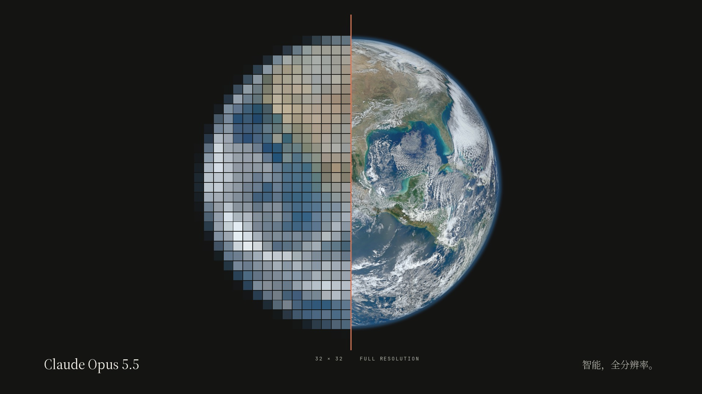

# 全分辨率 · Claude Opus 5.5 概念宣传片

一支 75 秒、带原创配乐的概念宣传片，主角是 Anthropic 最新一代旗舰模型 **Claude Opus 5.5**（2026-09-22 发布，Claude 5.5 家族的第一个模型）。

- 成片：[`output/claude_opus_5_5_resolution.mp4`](output/claude_opus_5_5_resolution.mp4)（1920×1080 · 30fps · H.264 + AAC 256k）
- 海报：[`output/poster.jpg`](output/poster.jpg)
- 画面、排版、动效、配乐全部由本目录的代码生成；真实影像来自 NASA 公有领域照片。



## 创意

**"智能的上限，就是分辨率。"** 全片只有一个视觉母题：**像素**。

一个陶土色的像素出现在黑暗里，随心跳般的节拍呼吸，然后分裂成 2×2、4×4……32×32，一个模糊的地球浮现出来。
之后每一种能力、每一行字都先以马赛克出现，再"显影"成清晰的样子；Claude 1 到 Claude 5 的像素柱一代代把"上限"顶高，
直到 Opus 5.5 冲破它——画面从扁平的色块直接坠入真实世界：利雅得的夜、喀喇昆仑的冰川、珠峰、巴哈马的浅滩，
每一个世界都缩成下一个世界里的**一个像素**，最后拉远成整颗地球，一条扫描线把它从 64×64 扫成全分辨率。
地球再收拢回最初那个像素，这个像素变成光标，打出 `Claude Opus 5.5`。

风格：简约、扁平，象牙白 / 墨黑两色底，只用一个强调色（陶土橙）；中文用思源宋体，英文用 Source Serif 4，数据读数用 JetBrains Mono。

## 分镜

| 时间 | 段落 | 画面 | 文案 |
| --- | --- | --- | --- |
| 00:00 | 一个像素 | 黑底上的陶土色像素随节拍呼吸 | 一切，从一个像素开始。 |
| 00:05 | 分辨率 | 像素展开成方块，逐拍分裂 1×1 → 32×32，地球浮现 | 分辨率每提升一次，世界就清晰一分。 |
| 00:10 | 01 读 READ | 文档墙被扫描线逐页"读清"，计数到 1,000,000 tokens | 百万 token 上下文 |
| 00:15 | 02 想 REASON | 推理树展开、剪枝，最后一条路径点亮出答案 | 先深思，再作答 |
| 00:20 | 03 写 CODE | 旧代码 → 新代码滚动迁移，计数到 680,000 行 | 68 万行代码迁移，不到一天 |
| 00:25 | 04 做 ACT | 屏幕先是马赛克再变清晰，像素光标点击、填表、提交 | 看懂屏幕，动手完成 |
| 00:30 | 05 信 TRUST | 散乱的像素在一拍上全部对齐 | 能力越强，越需要对齐。/ 更强大，也更值得信赖 |
| 00:35 | 上限 | Claude 1 → 5 的像素柱依次顶高"上限"，Opus 5.5 冲破它 | 每一代，都在推高智能的上限。/ 而今天的上限，是明天的起点。 |
| 00:45 | 真实世界 | 利雅得夜景 → 喀喇昆仑冰川 → 珠峰 → 巴哈马 → 地球，每一张都缩成下一张里的一个像素；最后一条扫描线把地球从 64×64 扫成全分辨率 | 从一个像素，到整个世界。 |
| 01:02 | 回到像素 | 地球收拢成一个像素，像素变成光标打出字标 | Claude Opus 5.5 · 智能，全分辨率。 |

## 文案里的事实与出处

宣传片里的能力描述都来自 Anthropic 的公开资料，没有编造的跑分：

| 文案 | 出处 |
| --- | --- |
| Claude Opus 5.5，Claude 5.5 家族的第一个模型（2026-09-22） | [Introducing Claude Opus 5.5](https://www.anthropic.com/claude-opus-5-5) |
| 百万 token 上下文 | Claude API 模型文档（Opus 5.5：1M context、128K 输出） |
| 先深思，再作答 | Claude API 文档：Opus 5.5 始终启用自适应思考（adaptive thinking），无法关闭 |
| 68 万行代码迁移，不到一天（一位早期测试者） | 同上发布页："One tester completed a 680,000-line code migration in less than a day" |
| 看懂屏幕，操作电脑 | 同上发布页：agentic coding、computer use、knowledge work 大幅提升 |
| 自动化行为审计中迄今表现最好的模型 | 同上发布页："On our automated behavioral audit, Opus 5.5 is the strongest-performing model we've tested to date" |
| Claude 1 (2023) · 2 (2023) · 3 (2024) · 4 (2025) · 5 (2026) · Opus 5.5 (2026) | 各代模型的公开发布时间 |

这是一支概念片 / 致敬作品，不是 Anthropic 官方出品，片中也没有使用 Anthropic 或 Claude 的官方标志。

## 影像（NASA，公有领域）

| 画面 | NASA ID | 说明 |
| --- | --- | --- |
| 利雅得夜景 | `iss033e020288` | Expedition 33 乘组于国际空间站拍摄（2012-11-13） |
| 喀喇昆仑冰川 | `iss069e060266` | 国际空间站拍摄（2023-08-15） |
| 珠峰与马卡鲁峰 | `iss008e13304` | Expedition 8 乘组于国际空间站拍摄（2004-01-28） |
| 巴哈马浅滩 | `iss065e144117` | Shane Kimbrough 于国际空间站拍摄（2021-06-23） |
| 地球 Blue Marble 2012 | `GSFC_20171208_Archive_e001386` | NASA/NOAA/GSFC/Suomi NPP/VIIRS/Norman Kuring |

均来自 [NASA Image and Video Library](https://images.nasa.gov)，构建时自动下载。

## 配乐

96 BPM、D 大调，全部用 numpy/scipy 现场合成（无采样）：毛毡钢琴、温暖的锯齿波 pad、加法合成拨弦琶音、
FM "玻璃音"（像素的声音）、FM 主旋律、合成鼓组、噪声上升音、冲击音、卷积混响。

- 一个四音动机 D–E–F♯–A 贯穿全片：开场钢琴、像素分裂时的"叮"声都是它；
- 高潮段主旋律每一小节的最高音都比上一小节更高（A → B → D → E → F♯），用声音去"推高上限"；
- 所有剪辑点、显影、冲击音共用 [`src/timeline.py`](src/timeline.py) 里的同一张时间表，画面和音乐逐拍对齐。

## 自己生成

依赖（Ubuntu）：

```bash
apt-get install ffmpeg fonts-noto-cjk fonts-noto-cjk-extra fonts-jetbrains-mono
pip install -r requirements.txt
```

生成：

```bash
python build.py                                   # 下载影像 → 合成配乐 → 渲染成片到 output/
python build.py --audio                           # 只重新合成配乐
python src/render.py --stills 8.6 33.6 58.6       # 输出指定时刻的静帧（PNG）
python src/render.py --range 44 50                # 只渲染一个时间段（预览）
python src/render.py --poster                     # 生成海报 output/poster.jpg
```

4 核机器上完整渲染约 8 分钟（配乐约 1 分钟）。

## 文件结构

| 文件 | 作用 |
| --- | --- |
| `src/timeline.py` | 唯一的时间表：BPM、每一个剪辑点 / 显影 / 冲击音的时刻 |
| `src/music.py` | 合成器、编曲、混音与母带 |
| `src/gfx.py` | 配色、缓动、抗锯齿图形、逐字"像素显影"文字、马赛克 / 分辨率引擎 |
| `src/scenes.py` | 全片分镜：每一段的画面与文案 |
| `src/assets.py` | 下载 NASA 原图并裁成方形"世界" |
| `src/render.py` | 多进程逐帧渲染，管道送入 ffmpeg 编码并合成音轨 |
| `assets/fonts/` | 构建时从 Google Fonts 下载的 Source Serif 4 Display（SIL OFL），其余字体来自系统包 |
